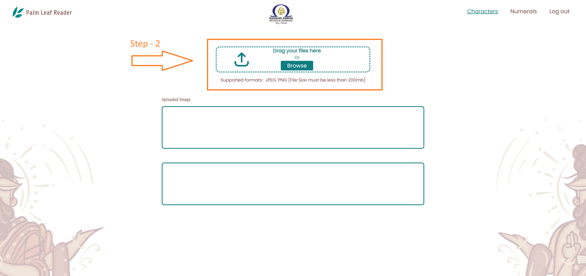

# AI-Based Palm Leaf Manuscript Reader
## Developed by Tamil Technology Research Center - Bannari Amman Institute Of Technology
 

    &nbsp;
   

 
We Won 🏆 3rd Prize at Kanitamil24 Hackathon for this project, and with the intention of developing the AI Tamil community, we are releasing the code of this project version 1.

## Our Team 💪
1. Dr.Balamurugan V T     - https://www.linkedin.com/in/balamurugan-varadarajan-52a41b6/
2. Mr.Pravin Savaridass M - https://www.linkedin.com/in/pravin-savaridass-00536b61/
3. Mr.Gokul S             - https://www.linkedin.com/in/gokul1308/
4. Mr.Udhayamoorthy S     - https://www.linkedin.com/in/udhaya-moorthy-277357259/
5. Mr.Harikrishnan S      - https://www.linkedin.com/in/harikrishnan-s-022804267/
6. Ms.Dhikshitha S        - https://www.linkedin.com/in/dhikshitha/
7. Ms.Nandhini S          - https://www.linkedin.com/in/nanthini-sk16/

## ⚠️CAUTION: This project may only be utilized for academic research by including citations in your study; It is not allowed for commercial use...

## How to run this project 🏃
1. #### Download⬇️ the code (from the top right corner)
   
2. #### Extract the zip file📁
   
3. #### Install python 3.10 or newer 🐍 
   Official Python Site: https://www.python.org/downloads/
  
4. #### Install the requirements 📝✅
   1. Open command prompt(cmd/terminal)
   2. change the directory to the downloaded project
   3. install the requirements in requirements.txt  
   You have many options 
   
   #### Directly pip install in the cmd 
   `pip install -r requirements.txt`

   (OR)

   #### Create a virtual environment in the project folder and install it (recommended) 
   - `python -m venv venv` - creating a virtual environment named venv 
   - `./venv/Scripts/activate` - to activate the virtual environment 
      
       NOTE: This may not allow some system to active the venv in the terminal 
       to overcome this run the following commands 
      `Set-ExecutionPolicy Unrestricted -Scope Process` 
      `Set-ExecutionPolicy Unrestricted -Force` 
      now run `./venv/Scripts/activate`

   - `pip install -r requirements.txt` - install the requirements
   
6. #### Run the **app.py** file 🏃‍♀️ 
   `python app.py` 
   The Application runs in `https://127.0.0.1:5000` default
7. #### Index page - About Our Team
   
   
9. #### Characters Page
   You can upload the palm leaf manuscripts by clicking the upload button and waiting for some time to get the output 
   Note: you can use the demo palm leaves in the 'static/input/' folder
   
   
   
   
10. #### Numerals Page
    You can also run the numerals page in the top right corner
    
    
    
    

### NOTE: The Deep Learning Model is trained using the data collected from Tamil Virtual Academy(TVA), the model can perform well if the input is similar as the given demo images

## Special Thanks 🙏
- **Dr.Muthukumar K**        - Tamil Department, Assistant Professor, Kongunadu Arts & Science College.
- **Tamil University - Tanjore**
- **Yakkai Arakattalai**
- **Tamil Virtual Academy (TVA)**
